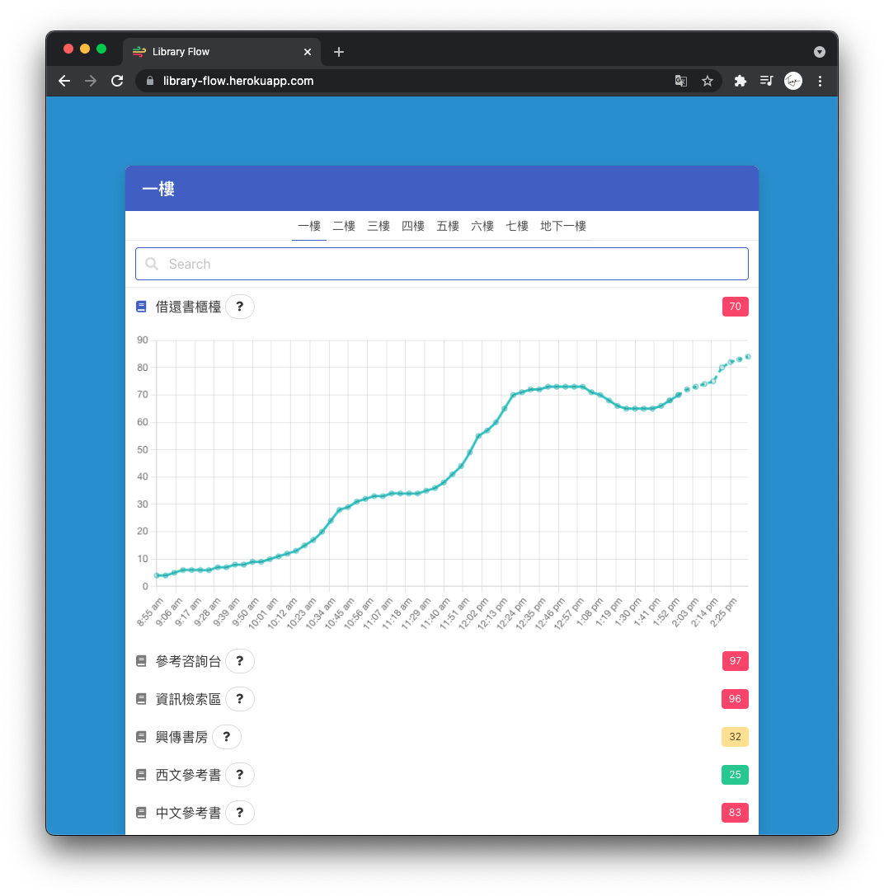

	

<h1 align="center">Library Flow</h1>

<i>See the flow 🌬, within books 📚.</i>

## What?

Collect bluetooth devices signal around each corner in library, visualize the crowd flow, and predict trends.

## Memo

[HackMD](https://hackmd.io/@CKNOQd5LSQmQqa-jFESD5g/ByRJEBB3O)

## Live Demo

Hosted on [Heroku](https://library-flow.herokuapp.com)

## Author

* Arduino - [Eddy Tan (bear3z)](https://github.com/bear3z)
* Server - [Tomy Hsieh (tomy0000000)](https://github.com/tomy0000000)

## Acknowledgement

Favicon is modified from [Wind Icon](https://iconscout.com/icons/wind) by [Feather Icons](https://iconscout.com/contributors/feathericons)